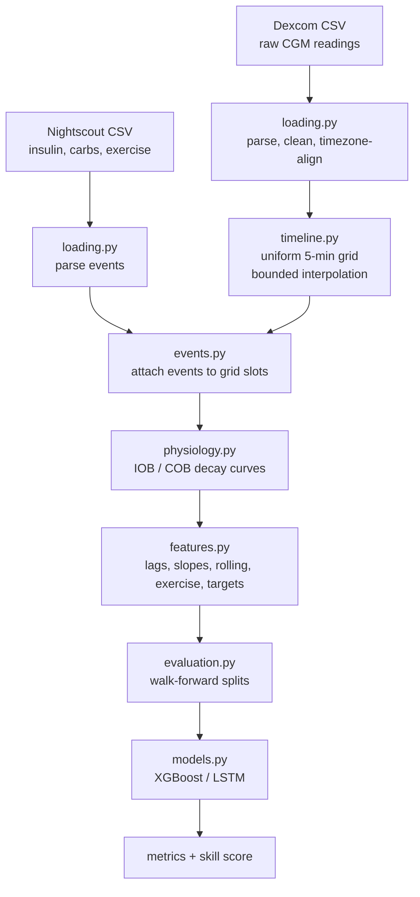
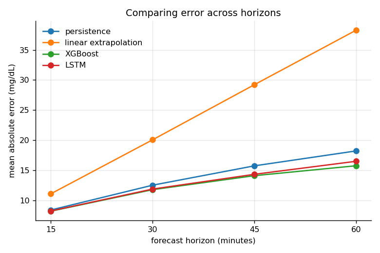
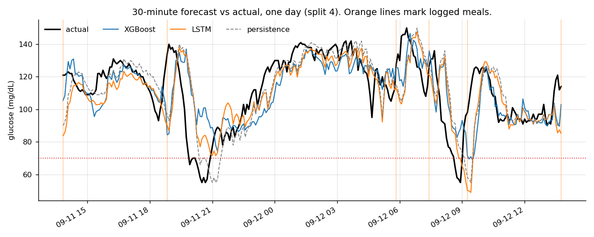
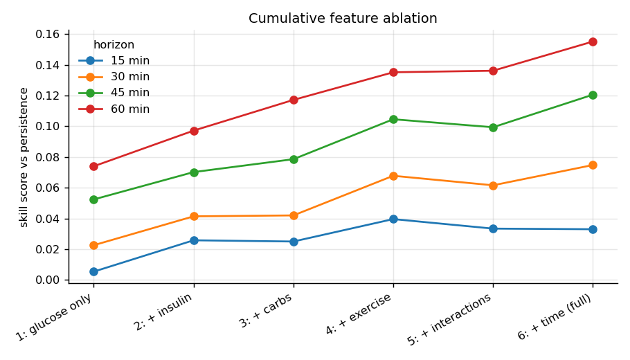
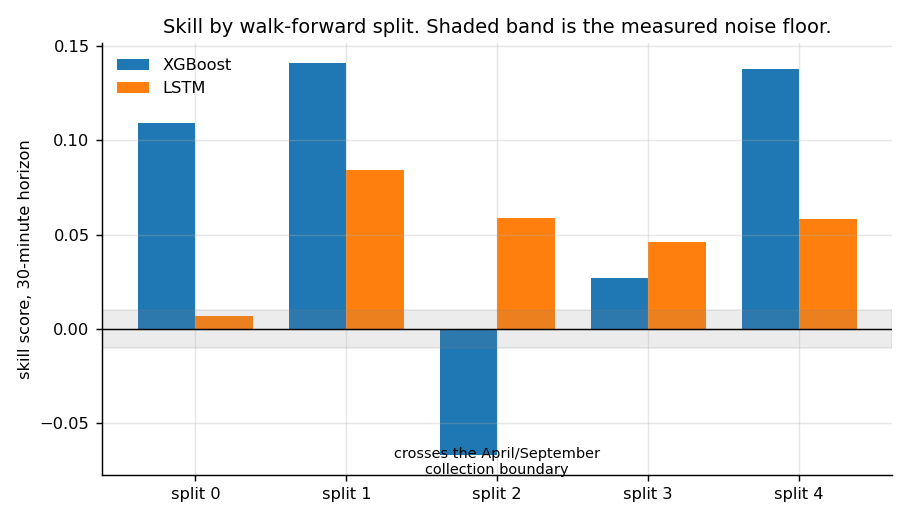

# Glucose Forecasting from Continuous Monitoring Data

Forecasting blood glucose 15–60 minutes ahead from a single subject's continuous glucose monitor, insulin, meal, and exercise data.

---

## ⚠️ Not for clinical use

This is strictly a personal research and educational project. Although it is medical-adjacent work, it is not validated, not approved, not intended for dosing decisions, and should not be treated as a medical device. It was conducted on single-subject data, so results do not generalize to other people. Anyone managing diabetes should follow the guidance of their care team.

---

## Highlights

- **MAE 11.8 mg/dL at a 30-minute horizon**, a skill score of 0.070 over the
  persistence baseline, pooled across five walk-forward splits.
- **The answer to "engineered features or learned representation" is
  conditional.** XGBoost on hand-built pharmacokinetic features beats an LSTM
  in every split where training and test share an insulin therapy regime, and
  loses in every split where they do not — consistent across all four horizons.
- **Insulin-on-board and exercise are the only feature groups that clear a
  measured noise floor of 0.01 skill** at every horizon. Interaction terms
  contribute nothing.
- **Models were frozen and publicly tagged before the evaluation data
  existed.** The holdout was collected September 15–26 and scored once, on
  September 27.
---

## Motivation

For someone with type 1 diabetes, managing glucose often requires anticipating where glucose is heading rather than reacting to where it is now. A continuous glucose monitor provides a current reading, but that reading describes the recent past. Because insulin takes time to begin affecting glucose levels, a decision based only on the current reading can come too late.

The goal of this project is to use historical glucose data, along with information such as meals, insulin, and activity, to forecast future glucose levels and provide an earlier indication of where glucose may be heading. A glucose forecast is intended as a decision-support and early-warning tool, not an automated insulin dosing system. In particular, predicting an upcoming decline could provide additional time to recognize and respond to a potential hypoglycemic event. More generally, forecasting is a way to test whether machine learning can identify patterns in an individual's glucose history that are not obvious from a single current reading.

This project uses my own continuous glucose monitoring data, making it a single-subject study. Rather than treating that as a limitation to hide, the project is designed around personalization: the model is trained specifically on one individual's glucose patterns and evaluated on future periods of that same individual's data. This provides a setting for investigating whether personalized models outperform general approaches, how much historical information is useful, and whether incorporating meals or activity improves forecasts.

---

## Research questions

**RQ1 — Encoded domain knowledge vs. learned representation.**
Does a gradient-boosted model using hand-built physiological features (insulin on board, carbohydrates on board) predict future glucose more accurately than an LSTM learning directly from raw sequences?

*Hypothesis:* I expect the gradient-boosted model will outperform the LSTM because the features such as IOB and COB explicitly encode physiological relationships that may be difficult for the LSTM to learn through data.

**RQ1a — Where does the answer flip?**
If one approach wins, is that a property of the method or of the data scale? Does a limited dataset favor XGBoost, while a sufficiently large one allows the LSTM to overtake it?

*Hypothesis:* Limited data favors XGBoost, because the physiological features supply structure the LSTM would otherwise have to learn from examples it does not have.

**RQ2 — Feature group contribution.**
How much does each group of features actually contribute to forecast accuracy? Is the marginal gain from adding a group such as exercise substantial, or is it within noise?

*Hypothesis:* The largest single gain will come from tier 2 (insulin-on-board), followed by tier 3 (carbohydrates-on-board), and both gains will grow with the horizon. Tiers 4 through 6 will show little improvement in accuracy. Exercise is logged less frequently than meals, and assigned arbitrary hand-assigned weights. Interactions are products a tree can already learn to approximate. Time of day provides context for things like level steadiness during sleep, or rising in the morning, but it partly redundant because meals and activities occur near the same times every day.

**RQ3 — Therapy transfer.**
This project spans two collection periods under two different treatment regimes: multiple daily injections (April–May) and an insulin pump in manual mode (August–September). Does a model trained under one regime transfer to the other?

*Hypothesis:* On the holdout (pump) data, M2 (September data) will outperform M1 (April data), because the holdout shares the same insulin therapy as M2. M3 (April/September combined) will outperform M1, but will fall below M2 for the XGBoost model. The LSTM model will perform best on the M3 data because a longer time frame for training will allow it to more accurately learn relationships.

---

## Data

### Source

Because of lost database records, the April–May data is a mixture of continuous glucose monitor readings downloaded directly from Dexcom and insulin, carbohydrate, and activity events hand-entered through Nightscout. For the September–October period, both the CGM readings and the event logs come from Nightscout.

Event logging is manual throughout. This is a known limitation and is discussed under *Cleaning and known data problems* below.

### Scale


| | April 21 – May 4 | Sept 1 – 13 |
|---|---|---|
| CGM readings | 3,786 | 3,616 |
| Days covered | 13.2 | 12.6 |
| Mean glucose (mg/dL) | 99.3 | 120.3 |
| Standard deviation | 16.5 | 26.6 |
| Time in range 70–180 | 97.2% | 94.7% |
| Hypoglycemic episodes (<70) | 38 | 24 |
| Meal and snack bolus records | 87 | 98 |
| Distinct eating occasions | 45 | 49 |
| Carbohydrate corrections | 33 | 36 |
| Correction boluses | 0 | 17 |
| Exercise sessions | 27 | 16 |
| Insulin therapy | Multiple daily injections | Pump, manual mode |

After resampling onto the 5-minute grid and concatenating, the development set
holds roughly 7,400 rows.

**The two periods are not interchangeable.** Mean glucose rises from 99 to 120
mg/dL and the standard deviation rises from 16.5 to 26.6 between them. September
is both higher and substantially more variable, which makes it a harder period
to forecast regardless of model. Correction boluses appear only in September,
because a pump makes small corrections trivial to deliver where an injection
does not. The therapy change is therefore visible in the data itself, not only
in the label attached to it — and it is the subject of RQ3.

Row counts overstate the information available. CGM readings are sampled every 5 minutes and are strongly autocorrelated with consecutive readings being nearly identical. The series of readings loses correlation over roughly 30-60 minutes. The effective number of independent observations is therefore closer to 600-1,200 than to the raw row count.

The practical consequence is that the constraint on this study is the number of events: meals, boluses, exercise sessions, and hypoglycemic episodes - not the number of rows. Error metrics are estimated across all data points, but predictions conditioned on a specific context (post-meal accuracy, hypoglycemic detection) rests on the event counts above.

### Cleaning and known data problems

The raw CGM data was restructured onto a uniform 5-minute timeline by rounding each timestamp to the nearest 5-minute interval. This improves consistency for time-series modeling but introduces a tradeoff between temporal accuracy and future leakage: a reading recorded at 1:43 is assigned to 1:45, meaning the rounded timestamp sits two minutes ahead of the actual measurement.

Specific cleaning decisions:

- **Bounded interpolation.** Missing values were interpolated only when the gap between observations was 20 minutes or less. This avoids artificially creating predictable straight-line glucose trajectories across longer periods where the true behavior is unknown. Gaps longer than 20 minutes were left as missing rather than filled.
- **Duplicate readings** were identified and removed during preprocessing.
- **Pre-bolus structure.** Insulin was consistently administered roughly 15 minutes before carbohydrate intake, and Nightscout records the two as separate entries. No merging is applied: the insulin record and the carb record stay 15 minutes apart, so insulin-on-board begins rising before carbohydrates-on-board does. That ordering matches the physiology, and the RQ2 ablation shows it has a measurable consequence — see Results.
- **Unrecoverable observations were excluded.** Some data quality issues could not be corrected without introducing assumptions about what actually occurred, so those observations were dropped rather than reconstructed.

The largest source of irreducible error is unlogged events. Food and insulin substantially affect glucose, but cannot be incorporated into the model when they were not recorded.

## Methods

### Pipeline



Each stage is a module in `src/`:

| Stage | Module | What it does |
|---|---|---|
| Configuration | `config.py` | Every tunable constant — paths, durations, thresholds, seed |
| Loading | `loading.py` | Reads both CSV sources; reconciles naive vs. UTC timestamps |
| Timeline | `timeline.py` | Resamples onto an even 5-minute grid; bounded interpolation |
| Events | `events.py` | Rounds events to grid slots and merges without fanout |
| Physiology | `physiology.py` | Converts discrete doses into active-amount columns |
| Features | `features.py` | Builds model inputs and prediction targets |
| Evaluation | `evaluation.py` | Walk-forward splits, baselines, metrics |
| Models | `models.py` | Feature groups, XGBoost, LSTM |

### Feature engineering

**Insulin on board and carbohydrates on board.** A dose taken at 2:00 PM is still acting at 3:30. The model needs a column stating how much is *currently active*, not merely whether a dose occurred in that row. Each dose is decayed forward across the grid and summed, so every row carries the total still-active amount (often referred to as insulin-on-board (IOB)).

The decay curve is a cubic smoothstep, `3x² − 2x³`, where `x` is the elapsed fraction of the substance's duration. This was chosen over a linear decay because its slope is zero at both end points: insulin does not reach full activity the instant it is injected, nor stop abruptly at the end of its window. A linear decay would introduce a corner in the data at both ends.

Durations are configured in `config.py`:

| Substance | Duration | Rationale |
|---|---|---|
| Bolus insulin | 210 min | Duration of insulin action for the rapid-acting analog used (humalog) |
| Meal carbohydrates | 180 min | Typical mixed-meal absorption window |
| Correction carbohydrates | 60 min | Fast-acting glucose taken to treat a low |

Meal and correction carbohydrates are tracked separately because they absorb on very different timescales. Collapsing them into one column would force the model to average the two distinct curves.

**Glucose dynamics.** Lags at 5, 10, 15, and 30 minutes give the tree model access to recent history, which it cannot otherwise see from a single row. Slopes over 5-60 minute windows are expressed in mg/dL per minute so they are directly comparable. Short windows may capture sensor noise, long windows capture trend, and the model is given both. Acceleration (the change in slope) distinguishes a rise that is still steepening from one that is flattening, two situations that are indistinguishable from slope alone but call for different responses. The rolling mean smooths noise, and the rolling standard deviation measures recent volatility.

**Time of day** is encoded as `sin` and `cos` of the hour rather than as an integer, so that 23:59 and 00:01 are adjacent rather than 23 units apart. Two components are required because either alone is ambiguous between morning and night.

**Exercise** is read from free-text notes and mapped to a type flag and an intensity weight (walking 0.3, lifting 0.7, basketball 0.5). These weights are judgment, not measurement. Two effects are modeled separately: intensity during the session, and a decaying `exercise_effect` afterward, since exercise raises insulin sensitivity for hours after it ends. The post-session effect decays with a 90-minute time constant and is truncated at 150 minutes. Sessions whose notes match no keyword are skipped rather than assigned a default, losing information but never mislabeling it.

**Interaction terms** supply products the tree model would otherwise have to approximate through repeated splits. The physiologically meaningful one is `iob_over_meal_cob` which roughly measures how well covered a meal is by the insulin taken for it.

**Feature groups** are defined in `models.py` and composed into a cumulative
ladder used for the ablation in RQ2:

| Tier | Groups included |
|---|---|
| 1 | Glucose dynamics only |
| 2 | + insulin on board |
| 3 | + carbohydrates on board |
| 4 | + exercise |
| 5 | + interactions |
| 6 | + time of day (full feature set) |

Timestamp, source and `is_interpolated` are excluded from all tiers: the first
two describe the dataset rather than the physiology, and `is_interpolated`
describes data quality rather than the subject.

### Targets

The model predicts the **change** in glucose from the current reading, not the absolute level. At prediction time the current reading is added back to recover mg/dL.

This was not the original design. Trained directly on absolute mg/dL with MAE loss, the LSTM collapsed to returning a near-constant value close to the mean (98 mg/dL) regardless of input. This occurred because predicting the average is a safe strategy when the model can't find useful patterns. With MAE, predicting a value near the center of the data can give relatively low error, so there is nothing to pull the model out of it. Predicting the delta recenters the target near zero, which removes the constant output as a viable strategy.

Targets are set to missing whenever the future value being predicted was **interpolated rather than measured**. Without this, the model would be scored on its ability to predict values that the pipeline generated, which are smooth by construction and easy to predict. Accuracy would improve but it would mean nothing. Rows shifted past the end of the series are treated as invented by default, so unknown cases are excluded.

### Models

Four predictors are compared at each horizon.

**Persistence baseline.** Predicts that glucose at time *t + h* equals glucose at time *t*. This is the floor that must be cleared, but it is a harder bar than it appears because glucose is smooth over short horizons, so predicting the same glucose value is a sensible guess.

**Linear extrapolation baseline.** Takes the current value and projects the 15-minute slope forward. This approximates what a person does mentally when reading a CGM arrow.

**XGBoost.** Gradient-boosted regression trees over the hand-built feature set. Hyperparameters are set conservatively against overfitting on a small dataset: shallow trees(max_depth=5), row and column subsampling at 0.8, L1 and L2 regularization, and a low learning rate across 300 estimators. A fixed random seed is required for reproducibility because column subsampling is random.

**LSTM.** A two-layer recurrent network (32 then 16 units, followed by a 16-unit dense layer) over a 60-step sequence - five hours of history - trained on a deliberately rawer feature set: glucose, raw insulin and carb amounts, exercise flags and time encoding, with no lags, slopes, or rolling statistics. The contrast is the substance of RQ1: features engineered from domain knowledge and handed to a tree model, versus a network given the raw sequence and required to learn the temporal structure itself.

Inputs are standardized with a scaler fit **on training rows only** and saved alongside the model, so the identical transformation is applied at prediction time. Early stopping monitors the final 15% of the training sequences (never the test block).

### Validation protocol

**No random train/test split is used anywhere in this project.** Randomly partitioning a time series places future observations in the training set and past observations in the test set, allowing the model to learn from data that would not have existed at prediction time. The resulting scores are inflated and uninterpretable.

**Walk-forward validation.** The series is divided into sequential blocks. The model trains on all data up to a boundary, is tested on the block immediately following, and the boundary then advances. This mirrors the only way the model could ever be used in practice: fit on the past, applied to the future.

**An enforced horizon gap.** Each training row carries a target drawn from *h* minutes ahead of it. Without intervention, training rows near the boundary have targets that fall *inside* the test block, meaning test-period glucose values have already been seen as labels. Training therefore stops short of the boundary by exactly the horizon length. This leak is invisible in results and is the reason the gap exists.

**Prospective holdout.** The holdout period, September 14–25, did not exist when the models were frozen on September 13. It cannot have influenced feature selection, hyperparameters, or any modeling decision.

**One split crosses the collection boundary.** Splits are defined by row position, not by date. With roughly 7,400 rows and five splits, split 2 is the only test block that spans the April-to-September transition: it trains almost entirely on April (MDI) data and tests almost entirely on September (pump) data. This is determined by row positions and is knowable without looking at any result, so split 2 is reported separately from the pooled development mean rather than dropped.

### Metrics

**Mean absolute error (mg/dL)** - the primary metric, chosen in advance. Directly interpretable as typical error magnitude.

**Root mean squared error (mg/dL)** - penalizes large misses more heavily than MAE. It is reported alongside MAE because the gap between them indicates whether error is spread evenly or driven by a few outliers.

**Skill-score** - '1 - (model MAE / baseline MAE)', computed against the persistence baseline. A score of 0 means no better than assuming glucose will not change, and a score of 0.15 means the model removed 15% of persistence's error, while negative means worse than doing nothing. 

**Hypoglycemia detection** - a confusion matrix at the 70 mg/dL threshold, reporting sensitivity (fraction of true lows predicted), specificity, and the number of low events in the window. Sensitivity is reported as undefined rather than zero when no lows occurred, since "identified none of them" and "there were none to identify" are different claims. Overall MAE can be excellent while every hypoglycemic event is missed, because lows are rare and contribute little to the average, which is why this is tracked separately.

MAE at the 30-minute horizon is the primary endpoint. All other metrics are secondary and reported for completeness.

## Results

All results below are from the development set — April 21 to May 4 and
September 1 to 13 — under five-fold walk-forward validation. Holdout results
are reported separately at the end of this section.

Every model at a given horizon and split is scored on the identical set of
rows: the intersection of rows where the target exists and all four predictors
produced a value. Without this the MAEs would describe different row sets and
the skill scores would be meaningless. Between 1,098 and 1,179 rows are scored
per split, out of test blocks of roughly 1,234. The shortfall is almost
entirely the LSTM's 60-step warm-up, which removes the first five hours of
every test block — a systematic exclusion rather than a random sample.

### Headline accuracy

Mean absolute error in mg/dL, averaged over five splits:

| Horizon | Persistence | Linear | XGBoost | LSTM |
|---|---|---|---|---|
| 15 min | 8.41 | 11.10 | **8.21** | 8.25 |
| 30 min | 12.53 | 20.07 | **11.78** | 11.88 |
| 45 min | 15.74 | 29.22 | **14.11** | 14.33 |
| 60 min | 18.22 | 38.28 | **15.75** | 16.50 |

Skill score against persistence:

| Horizon | XGBoost | LSTM |
|---|---|---|
| 15 min | 0.028 | 0.021 |
| 30 min | 0.070 | 0.051 |
| 45 min | 0.116 | 0.086 |
| 60 min | 0.149 | 0.093 |



Both models beat persistence at every horizon, and the margin widens as the
horizon lengthens — which is what physiological features should do. At 15
minutes the future is nearly determined by the recent trace and there is little
for a model to add. At 60 minutes the outcome depends on insulin and
carbohydrate activity that has not yet appeared in the glucose trace.



### RQ1 — engineered features vs learned representation

Comparing averages over five splits is weak evidence. The paired comparison is
stronger, and it is not the simple result the hypothesis predicted.

XGBoost wins 3 of 5 splits at every horizon — and it is the **same three splits
every time**. XGBoost wins splits 0, 1 and 4; the LSTM wins splits 2 and 3, at
all four horizons, without a single exception in twenty split-horizon pairs.

| | Training data | Test data | Winner |
|---|---|---|---|
| Split 0 | April | April | XGBoost |
| Split 1 | April | April | XGBoost |
| Split 2 | April | Mostly September | LSTM |
| Split 3 | April + ~1,100 September rows | September | LSTM |
| Split 4 | April + ~2,400 September rows | September | XGBoost |

The pattern is not random. XGBoost wins wherever training and test share an
insulin therapy regime, and loses wherever they do not.

A plausible mechanism: the engineered features encode insulin pharmacokinetics
explicitly, through a fixed duration-of-action curve. When the delivery method
changes, those columns keep describing the old regime with full confidence. The
LSTM, working from raw sequences, has learned a looser representation and
degrades more gracefully when the underlying process shifts.

Stated as an answer to RQ1: **encoded domain knowledge wins when the encoding
still holds, and is a liability when it does not.** The original hypothesis —
that XGBoost would simply win — was right on average and wrong about the
mechanism. RQ3 tests this directly on the holdout.

Excluding split 2, the boundary-crossing block:

| Horizon | Persistence | XGBoost | LSTM | XGB skill | LSTM skill |
|---|---|---|---|---|---|
| 15 min | 7.96 | 7.50 | 7.71 | 0.057 | 0.031 |
| 30 min | 11.84 | 10.66 | 11.26 | 0.104 | 0.049 |
| 45 min | 14.74 | 12.78 | 13.52 | 0.142 | 0.080 |
| 60 min | 16.99 | 14.31 | 15.50 | 0.168 | 0.088 |

### Noise floor

Re-running the ablation under a second random seed moved mean skill by at most
0.0078 and any single marginal gain by at most 0.0086. **The noise floor is
0.01 skill.** Any difference smaller than that is not distinguishable from the
stochasticity of row and column subsampling, and no claim below rests on one.

Both runs are committed: `reports/dev_ablation_seed42.csv` and
`dev_ablation_seed7.csv`.

### RQ2 — feature group contribution

Mean skill score by cumulative tier:

| Tier | 15 min | 30 min | 45 min | 60 min |
|---|---|---|---|---|
| 1: glucose only | 0.005 | 0.023 | 0.052 | 0.074 |
| 2: + insulin | 0.026 | 0.041 | 0.070 | 0.097 |
| 3: + carbs | 0.025 | 0.042 | 0.079 | 0.117 |
| 4: + exercise | 0.040 | 0.068 | 0.105 | 0.135 |
| 5: + interactions | 0.033 | 0.062 | 0.099 | 0.136 |
| 6: + time (full) | 0.033 | 0.075 | 0.121 | 0.155 |

Marginal gain from each group. Bold clears the 0.01 noise floor:

| Group added | 15 min | 30 min | 45 min | 60 min |
|---|---|---|---|---|
| insulin on board | **0.020** | **0.019** | **0.018** | **0.023** |
| carbohydrates on board | −0.001 | 0.001 | 0.008 | **0.020** |
| exercise | **0.015** | **0.026** | **0.026** | **0.018** |
| interactions | −0.006 | −0.006 | −0.005 | 0.001 |
| time of day | 0.000 | **0.013** | **0.021** | **0.019** |



**Insulin on board is the only group that helps at every horizon.** It is also
the largest single contributor, and its gain is flat across horizons rather than
growing — insulin is acting on the whole 15-to-60-minute window.

**Carbohydrates contribute nothing until 60 minutes.** This was not predicted
and it is a consequence of the logging structure described under *Cleaning*:
insulin is dosed roughly 15 minutes before carbohydrates are recorded, so
insulin-on-board is already signalling that a meal is coming by the time
carbohydrates-on-board rises. Most of the information carbohydrates could
supply at short horizons has already been supplied by insulin. Only at 60
minutes, when absorption dominates and the insulin signal has partly decayed,
does the carbohydrate column add something of its own.

A caveat on the ladder: a cumulative ablation assigns shared credit to whichever
group appears first. Insulin is tier 2 and carbohydrates are tier 3, so insulin
collects the overlap between them and carbohydrates look weaker than they would
in isolation.

**Exercise was predicted to be within noise and is not.** It is the second
largest contributor at every horizon, from 43 logged sessions with hand-assigned
intensity weights. The hypothesis was wrong.

**Interaction terms contribute nothing, and are slightly negative at three of
four horizons.** This matches the mechanism: a tree already approximates a
product through repeated splits, so the interaction columns are redundant, and
adding redundant columns dilutes the column subsample at each split.

**Time of day earns its place at 30 minutes and beyond.** Taken together with
the exercise result, a meaningful share of the model's skill appears to come
from routine — predictable meal and activity timing — rather
than from physiology alone. That is a real effect for a single-subject model
and a reason to expect it would not transfer to another person.

### Split-to-split variation



Skill varies substantially across splits, and split 2 is negative for XGBoost at
three of four horizons. Split 2 is the block that crosses the April–September
boundary, so it is measuring therapy transfer rather than generalization. It is
shown but excluded from the pooled means quoted above.

Both architectures degrade in split 2. Two models with nothing in common do not
fail in the same window by coincidence — the cause is in the data, not in either
model.

### RQ3 — therapy transfer (HOLDOUT)

<!-- Sept 26. M1 / M2 / M3 on the holdout, all four horizons, none primary. -->

### Prospective holdout (HOLDOUT)

<!-- Sept 26. Run evaluate_holdout.py once. Report the table, the hypo
     confusion matrix, and what the pre-registered hypotheses got right and
     wrong. Record results you do not like. -->
---

## Limitations

**Single subject.** All data describes one person. Nothing here generalizes to other individuals, and no claim about glucose forecasting in general is supported by it.

**Small effective sample size.** Aggregate MAE and skill score are adequately supported by a large number of CGM readings. Claims conditioned on context are not. Hypoglycemic sensitivity rests on 62 low events and post-meal accuracy rests on 94 meals, and confidence intervals at those sample sizes are wide.

**Manual event logging.** Insulin, carbohydrate, and exercise events are entered by hand. Unlogged or mis-timed events are the largest source of irreducible error.

**Carbohydrate estimates.** Grams are estimated by eye at logging time, not measured. Error in that estimate spreads directly into COB features.

**A therapy change occurs inside the dataset.** The development and holdout periods use different insulin delivery methods (MDI and pump). This is the subject of RQ3, but it means holdout performance confounds model generalization with therapy transfer, and the two cannot be fully separated with this data.

**Exercise intensity weights are assigned, not derived.** The values 0.3, 0.7, and 0.5 are my judgment about relative intensity. They were not fit to the data and have no empirical basis.

**Rounding to the 5-minute grid** places each reading up to 2.5 minutes away from its true timestamp. For a rounded-up reading this means the assigned time is slightly ahead of the measurement.

**No external benchmark comparison.** Results are not directly comparable to published work on OhioT1DM or similar datasets, which differ in subject, device, duration, and logging fidelity. Any apparent difference in MAE across studies reflects those differences at least as much as it reflects model quality.

**Encoded physiology is brittle across regimes.** The IOB and COB features
assume a fixed duration of insulin action. When the delivery method changed, the
tree model that relies on them lost to the LSTM in every split spanning the
transition. A feature that encodes a fixed assumption inherits that assumption's
failure modes.

**Part of the model's skill is routine, not physiology.** Time of day and
exercise flags together account for a substantial share of the ablation gain.
For a single-subject model with regular meal and activity timing, some of the
apparent predictive power is the model learning a schedule. This would not
transfer to a subject with an irregular routine, and it is not separable from
the physiological signal with this data.

## Repository structure

```text
Artificial-Pancreas/
├── src/
│   ├── config.py               every tunable constant: paths, durations, thresholds, seed
│   ├── loading.py              reads Dexcom and Nightscout exports, reconciles timezones
│   ├── timeline.py             resamples onto a uniform 5-minute grid, bounded interpolation
│   ├── events.py               rounds events to grid slots and merges without fanout
│   ├── physiology.py           decays doses into insulin- and carbs-on-board columns
│   ├── features.py             lags, slopes, rolling statistics, exercise, prediction targets
│   ├── evaluation.py           walk-forward splits, baselines, metrics, skill score
│   ├── models.py               feature tiers, XGBoost, LSTM, sequence construction
│   ├── pipeline.py             the one function every collection period passes through
│   └── nightscout_scraper.py   API client; documents provenance, not runnable without credentials
│
├── scripts/
│   ├── main.py                 raw exports in, development.parquet out
│   ├── fetch_nightscout.py     pulls treatment records for a date range
│   ├── evaluate_dev.py         RQ1 walk-forward comparison and RQ2 feature ablation
│   ├── freeze.py               trains M1/M2/M3 at four horizons, serializes 36 files
│   ├── make_figures.py         builds the four figures from saved results
│   └── evaluate_holdout.py     scores the frozen models once against the holdout
│
├── data/
│   ├── raw/                    Dexcom Clarity and Nightscout exports
│   └── processed/
│       └── development.parquet the feature table every model was trained on
│
├── models/                     36 frozen model files
│   └── freeze_manifest.csv     SHA-256 hash, size and training rows for each
│
├── reports/
│   ├── dev_rq1_seed42.csv      per-split MAE and skill for all four predictors
│   ├── dev_ablation_seed42.csv feature tier ablation
│   ├── dev_ablation_seed7.csv  the same ablation reseeded, for the noise floor
│   ├── dev_predictions_seed42.parquet  per-row predictions, used for the figures
│   └── figures/                the four README figures
│
├── requirements.txt
├── LICENSE
└── README.md
```
---

## Use of AI assistance

I used Claude as a development tool throughout this project, primarily to help with implementation, debugging, and explanation of unfamiliar methods. I was responsible for the overall project and for making, testing, and validating the decisions that went into the final pipeline.

**What I did.** I collected and organized the data, defined the research questions, chose the physiological durations and exercise weights, and designed the overall modeling and evaluation approach. I compared different validation strategies and settled on the prospective holdout design with the three-variant comparison, established the freeze date, and ran and evaluated the experiments. I worked through the data issues and debugging throughout development, including catching the pre-bolus double-logging issue that was inflating the meal counts. I also reviewed code closely, modified it as the project evolved, and tested the full pipeline.

**How I used the assistant.** Claude helped me turn parts of my ideas into working code, troubleshoot errors, explain methods I had not encountered before, and suggest possible approaches when I was stuck. It drafted portions of `scripts/` and `src/`, which I then reviewed, adapted, integrated, and tested. Some of the more useful decisions that came out of this back-and-forth discussion included the delta-target approach for the LSTM constant-output problem, enforcing a horizon gap, and using intersection scoring so the four predictors could be compared fairly. I also used it to help draft and refine documentation including the README.

The important distinction is that the assistant was a tool in the development process, not the source of the project's direction. I made the research and design decisions, determined whether a proposed solution actually made sense for this context, and validated the final results. I can explain the pipeline, the reasoning behind the modeling choices, and the tradeoffs involved.


## License

MIT — see [LICENSE](LICENSE). The license covers code. The CGM and event data in
`data/` is my own and is published for verification under the same
terms.
---

